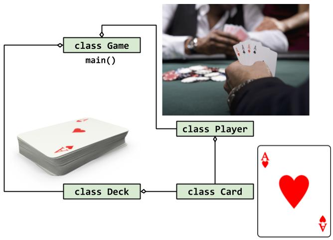
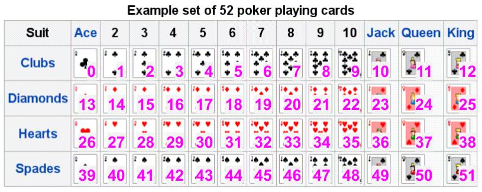

# Lab 11: Card Game with C++ Classes (Part 2 of 3)


### Learner Objectives
At the conclusion of this lab assignment, participants should be able to:
* Define, implement and use a class 

### Acknowledgements
Content used in this assignment is based upon information in the following sources:
* This program is a modified version of a student homework for CptS 122 at WSU by Dr. John Schneider.

## Getting Started
1. Open terminal.
2. Make sure your current working directory is `~/cs150/lab/lab11`. Navigate to this directory if needed.
3. Open Visual Studio Code by typing in the terminal `code .`



## C++ Vector Review
* Must include `<vector>`
* To declare a vector of integers, `vector<int> vecIntegers`
* To add to the end of the vector, `vecIntegers.push_back(3)`
* To access an element of the vector, use the square brackets, `vecIntegers[0]`
* To get the size of the vector, `vecIntegers.size()`
* To determine if vector is empty, `vecIntegers.empty()`
* To remove the last item of the vector, `vecIntegers.pop_back()`

> **IMPORTANT NOTE**: Up to this point, we can ONLY add and remove items from the back or end of a `vector`. This is important to understand and remember in order to complete this lab.




## Part II - Deck class
The focus of today's lab is to write the `Deck` class. How can we represent a deck of cards as a C++ object? Since you will continue to work with the code from the previous lab, you just need to create two additional files.

1. Create two files.
    - [ ] `deck.cpp` - Class implementation file
    - [ ] `deck.h` - Class declaration/interface file
    
2. **Carefully read the comments in the codes** below as it will guide you to what code needs to be written.

#### deck.h
This header file will hold the `Deck` class declaration.
- [ ] Make sure you have a file header comment.
- [ ] Ensure that you use the guard code. 
- [ ] Inside the guard code, write the code to include the following header files
    - [ ] `<vector>` - use to declare C++ vectors to store 52 `Card` objects
    - [ ] `<cstdlib>` - will be used to randomly deal cards
    - [ ] `<ctime>` - use `time()` with `srand()`
    - [ ] Include `Card` class header file since the `Deck` class is a composition of `Card` objects
- [ ] Just below the global constant, write the code to create a class called `Deck`
    - [ ] The `Deck` class will have the following member functions and variable
        * `Deck()` - class default constructor
        * `void reset()` - reset deck to new state (completely undealt)
        * `void printUndealtDeck() const` - print all cards in the undealt deck
        * `void printDealtDeck() const` - print all cards in the dealt deck
        * `bool isEmpty() const` - determines if there is no cards left to deal
        * `Card dealCard()` - is the `dealCard()` here an accessor or mutator function???
        * `vector<Card> mUndealt` - contains all cards that has not been dealt yet
        * `vector<Card> mDealt` - holds a copy for each card that has already been dealt
- [ ] Commit your code with message `"Deck class declaration file created"`

#### deck.cpp
The `deck.cpp` file is where you will write the class implementation code for the `Deck` member functions. 
- [ ] Make sure you have a file header comment.
- [ ] Make sure that at the top of this file, you include `deck.h`
- [ ] Make sure that each function has a function header comment.
- [ ] Commit your code with message `"Deck class implementation file created"`

```cpp
// Code implementation of the Deck member functions goes inside this file

// Deck() --- default class constructor
//   1. initialize random number generator 
//          srand(time(0));
//   2. Create the deck of cards (52 Card objects)
//          loop 52 times
//             a. create an instance of the Card class
//             b. set the card instance to the value of the counter
//             c. add the card to the undealt deck vector

// void printUndealtDeck() const - print all cards in the undealt deck vector
//                                 if empty, print "Empty deck!"
//   counter loop based on the size of the vector
//       a. access an element of the vector which is a Card object
//       b. Use the Card object's print member function
//       c. go to the next element

// void printDealtDeck() const - print all cards in the dealt deck vector,
//                               if empty, print "Empty deck!"
//   counter loop based on the size of the vector
//       a. access an element of the vector which is a Card object
//       b. Use the Card object's print member function
//       c. go to the next element

// bool isEmpty() const --- return true if there are no cards left to deal, false otherwise

// void reset() --- Reset the deck (completely undealt). We are moving all the cards in 
//                  the dealt vector back to the undealt vector.
//   loop while the dealt deck is not empty
//       a. compute for the last index of the dealt deck vector and save it to a variable
//       b. get the Card from the last index in the dealt vector then,
//       c. push that Card back to the undealt vector
//       d. remove the last Card from the dealt vector

// Card dealCard() --- Deal a single card
//   1. get a random card through an random index 
//      (HINT: As cards are dealt, the deck size gets smaller. 
//             Ensure, random index is a valid random index)
//   2. swap the last card in the undealt deck with the random card in the undealt deck
//      a. using the random index, get the random card from the undealt deck and assign 
//         to a new instance of the Card
//      b. assign or copy the last Card to the Card at the random index position in the undealt deck
//      c. assign or copy the random card from Step a) to the last Card in the undealt deck
//   3. then add or push a copy of the random card to the dealt deck vector
//   4. remove the last card in the undealt deck
//   5. return the random card
```

#### main.cpp
The `main.cpp` file is where you will test your `Deck` class.
- [ ] Make sure you have a file header comment.
- [ ] Must include `card.h` and `deck.h`
- [ ] Delete or comment out the code you have for `main()` from the previous lab.
- [ ] Write the program for `main()` using the comments and make sure output of the program is exactly the same as the **Sample Run** below.
- [ ] Fix all bugs, then present work to instructor.
- [ ] Commit code with message `"Code reviewed by instructor. Deck class completed."`.
- [ ] Submit Github URL to Canvas.
```cpp
#include <iostream>
using namespace std;

int main()
{
    // Create an instance of the Deck class    

    cout << "Random Cards:\n";
    cout << "============\n";
    // loop 7 times
    //     deal a random card from the deck
    //     print the card's face value
    
    cout << "\n\nList of Cards Dealt from the Deck:\n";
    cout << "============\n";
    // call Deck's appropriate member function to print out this list

    cout << "\n\nList of Cards Remaining in the Deck:\n";
    cout << "============\n";
    // call Deck's appropriate member function to print out this list
    
    cout << "Press enter to continue...\n";
    cin.get();
    system("clear");
    
    // reset the Deck
    
    cout << "\n\nList of Cards in the Deck:\n";
    cout << "============\n";
    // call Deck's appropriate member function to print out this list

    return 0;
}
```

### Sample Run
The output of your program will have a different sequence since the cards will be dealt randomly.
```
Random Cards:
============
Three of Diamonds
Four of Hearts
King of Clubs
Seven of Spades
Ten of Diamonds
Jack of Hearts
Eight of Diamonds

List of Cards Dealt from the Deck:
============
Three of Diamonds
Four of Hearts
King of Clubs
Seven of Spades
Ten of Diamonds
Jack of Hearts
Eight of Diamonds

List of Cards Remaining in the Deck:
============
Ace of Clubs
Two of Clubs
Three of Clubs
Four of Clubs
Five of Clubs
Six of Clubs
Seven of Clubs
Eight of Clubs
Nine of Clubs
Ten of Clubs
Jack of Clubs
Queen of Clubs
Jack of Spades
Ace of Diamonds
Two of Diamonds
King of Spades
Four of Diamonds
Five of Diamonds
Six of Diamonds
Seven of Diamonds
Ten of Spades
Nine of Diamonds
Nine of Spades
Jack of Diamonds
Queen of Diamonds
King of Diamonds
Ace of Hearts
Two of Hearts
Three of Hearts
Queen of Spades
Five of Hearts
Six of Hearts
Seven of Hearts
Eight of Hearts
Nine of Hearts
Ten of Hearts
Eight of Spades
Queen of Hearts
King of Hearts
Ace of Spades
Two of Spades
Three of Spades
Four of Spades
Five of Spades
Six of Spades

Press enter to continue...

List of Cards in the Deck:
============
Ace of Clubs
Two of Clubs
Three of Clubs
Four of Clubs
Five of Clubs
Six of Clubs
Seven of Clubs
Eight of Clubs
Nine of Clubs
Ten of Clubs
Jack of Clubs
Queen of Clubs
Jack of Spades
Ace of Diamonds
Two of Diamonds
King of Spades
Four of Diamonds
Five of Diamonds
Six of Diamonds
Seven of Diamonds
Ten of Spades
Nine of Diamonds
Nine of Spades
Jack of Diamonds
Queen of Diamonds
King of Diamonds
Ace of Hearts
Two of Hearts
Three of Hearts
Queen of Spades
Five of Hearts
Six of Hearts
Seven of Hearts
Eight of Hearts
Nine of Hearts
Ten of Hearts
Eight of Spades
Queen of Hearts
King of Hearts
Ace of Spades
Two of Spades
Three of Spades
Four of Spades
Five of Spades
Six of Spades
Eight of Diamonds
Jack of Hearts
Ten of Diamonds
Seven of Spades
King of Clubs
Four of Hearts
Three of Diamonds
```

## Submitting Assignments
* It is VERY IMPORTANT that besides pushing the code to GitHub that you still submit the GitHub URL of this lab assignment in Canvas. This allows the instructor to be notified of your final submission.

> **_NOTE: By submitting your code to be graded, you are stating that your submission does not violate the Academic Integrity Policy outlined in the syllabus._**
